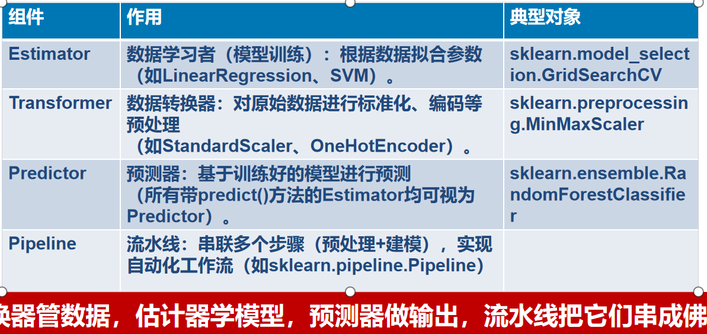

# 第四次课

## 上次课回顾
金钱使人幸福

k个 nearestNeigbower

## 机器学习主要挑战：数据，算力，模型

数据集：训练&验证&测试模型

经典数据集（iris）：鸢尾花

sklearn or tensorflow
## 插播——关于数据

| 表头 | x_1 | x_2 | x_3 |
| ---- | --- | --- | --- |
| -    | -   | -   | -   |
| -    | -   | -   | -   |

机器学习模型主要使用**结构化数据**，即二维数据图片与视频非分结构化数据 

| 术语   | 含义                   |
| ------ | ---------------------- |
| 实例   | 每一行记录为实例       |
| 特征   | 反映对象在某方面的性质 |
| 特征值 | 特征的取值             |
| 标签   | 结果显示               |
| 样例   |

## 第二章
端到端机器学习项目
| 序号 | 主要步骤             |
| ---- | -------------------- |
| 1    | 放眼大局             |
| 2    | 获取数据             |
| 3    | 探索与可视化数据     |
| 4    | 为机器学习准备数据   |
| 5    | 选择一模型并训练     |
| 6    | 微调模型             |
| 7    | 展示解决方案         |
| 8    | 发布，监控，维护系统 |

有监督学习，回归模型

# 第五次课
## 插播——评价指标解释
评级误差的两种距离方式

| L1范数（曼哈顿距离）       | L2范数(欧几里得距离)           |
| -------------------------- | ------------------------------ |
| 向量的各个分量的绝对值之和 | 向量的各个分量的平方和的平方根 |

$$
\text{RMSE}(X, h) = \sqrt{\frac{1}{m} \sum_{i=1}^{m} \left( x^{(i)}) - y^{(i)} \right)^2 }
$$
>m是你测量RMSE的数据集中的实例数。如你在2000个地区的验证集上评估RMSE，则m=2000。 
$x(i)$是数据集中第i个实例的所有特征值（不包括标签）的向量， 
$y(i)$是它的标签（该实例的期望输出值，或者说就是实际解）， 
$h$是系统的预测函数，给定模型一个实例特征向量x(i)时，模型会给出一个预测h(x)，通常也叫y帽。 

## 3探索和可视化数据以获得见解——探索训练集（不看测试集）

### 3.2寻找相关系数
用corr()方法算出每对属性之间标准相关系数（也称为皮尔逊r）
### 3.3实验不同属性组合—
有些属性可能组合起来更有用
## 4.为机器学习算法准备数据
### 4.1 清洗数据——见配套书籍
Scikit-Learn类：SimpleImputer是更佳的选择

>缺失值也可以替换为平均值(strategy="mean")，
或替换为最频繁的值(strategy="most_frequent")，
或替换为常数值(strategy="constant"，fill_value=...)。最后两种策略支持非数值数据。
### 4.2 特征缩放与转换
最小—最大缩放（很多人称之为归一化）：

——对于每个属性，值被移动和重新缩放，这样它们最终值在0～1之间。

——Scikit-Learn为此提供了一个名为MinMaxScaler的转换器
### 插播——Scikit-learn四大组件

### 4.3 转换流水线
以正确的顺序执行许多数据转换步骤。
————Scikit-Learn提供了Pipeline类来帮助处理此类转换序列。

# 第六次课
## Mnist数据集
图像分类时，通常的步骤包括数据准备、数据预处理、模型选择、模型训练和模型评估。由于MNIST数据集已经进行了预处理，因此不需要额外的数据清洗和预处理操作。但是可以对图像进行可视化，观察图像的分布和特征。
### 1先看简单的“二元”分类器
MNIST本质上是10元标签（0-9），以“5”为例，把其他数字都视为一类，则转化为“二元”问题。【5占10%，其他占90%】
### 2交叉验证
使用cross_val_score()函数来评估我们的SGDClassifier模型，使用3个折叠的k折交叉验证。k折交叉验证意味着将训练集分成k个折叠（在本例中为3个折叠），然后对模型进行k次训练，每次使用不同的折叠进行评估。
### 3混淆矩阵（Confusion Matrix）
混淆矩阵（Confusion Matrix）是一种用于评估分类模型性能的工具，特别适用于二分类和多分类问题。它可以直观地展示模型的预测结果与实际类别之间的对比。
| 真实 \ 预测  | 预测正类 (Positive) | 预测负类 (Negative) |
| ------------ | ------------------- | ------------------- |
| 真实正类 (P) | 真阳性 (TP)         | 假阴性 (FN)         |
| 真实负类 (N) | 假阳性 (FP)         | 真阴性 (TN)         |
- 真阳性（True Positive，TP）: 真实为正类，模型也预测为正类
- 假阳性（False Positive，FP）: 真实为负类，模型错误预测为正类（即“假警报”）
- 假阴性（False Negative，FN）: 真实为正类，模型错误预测为负类（即“漏检”）
- 真阴性（True Negative，TN）: 真实为负类，模型也预测为负类
### 评价指标
准确率
$$
    Acurracy = \frac{TP+TN}{TP+FP+FN+TN}
$$
精确率
$$
    Precision = \frac{TP}{TP+FP}
$$
召回率
$$
    Recall = \frac{TP}{TP+FN}
$$
F1调和均值，也称为F1 Score，是评估分类模型性能的重要指标之一。它通过调和平均的方式将精确率（Precision）和召回率
$$
    F1=\frac{2x(PrecisionxRecall)}{Recision+Recall}
$$
ROC曲线Receiver Operating Characteristic Curve

ROC曲线是真阳性率（召回率）与假阳性率(False Positive Rate，FPR)分别作为y和x轴
ROC曲线是一种用于评估分类模型性能的图形工具，特别是在二分类问题中。
## 多分类器
一些Scikit-Learn分类器（例如，LogisticRegression、RandomForestClassifier和GaussianNB）能够原生地处理多个类。
其他的是严格的二元分类器（例如SGDClassifier和SVC）。
### 一对其余(One-Versus-the-Rest，OvR)策略，有时也称为一对全部(One-Versus-All，OvA)
可以将数字图像分为10类（从0到9）的系统的一种方法是训练10个二进制分类器
### 一对一(One-Versus-One，OvO)策略
为每对数字训练一个二元分类器：一个区分0和1，另一个区分0和2，另一个区分1和2......
有N个类，则需要训练N×(N-1)/2个分类器

### 多标签分类
你可能希望分类器为每个实例输出多个类，输出多个二进制分类标签的叫“多标签分类”
如图像识别分类器可以训练后可以认识 ABCD四个人，你给他含有AB的照片，则输出【1100】
### 多输出分类
多输出—多类分类（或简单称为多输出分类）。它是多标签分类的推广
每个标签可以是多类的（即它可以有两个以上的可能值）

# 第七次课
线性回归预测模型
$$
y = \theta_0x_0+\theta_0x_0+\theta_2x_2+\theta_3x_3+...
$$
模型如何训练出来
## 回归问题训练
就是对输入特征加权求和，再加上一个我们称为偏置项（也称为截距项）的常数，进行预测

## 标准方程求解
## 最小二乘法
假设已知5个点坐标，要回归出一条直线使得误差最小，y=aX+b(用最小二乘法选择a和b)

误差方程求偏导，再解方程，得到系数

过拟合，泛化能力降低

欠拟合，泛化能力降低
## 梯度下降
而梯度下降法是一种迭代法，先给定一个θ，然后向Δ下降最快的方向调整θ，在若干次迭代之后找到局部最小。
| 方法           | 用法                             | 特点                                                                 |
| -------------- | -------------------------------- | -------------------------------------------------------------------- |
| 批量梯度下降法 | 每次迭代用全部实例               | 计算量大                                                             |
| 随机梯度下降法 | 每次迭代用一个随机的实例         | 计算快、更新方向也随机会在全局最小值附近波动，而不是直接收敛到最小值 |
| 小批量随机梯度 | 每次迭代用一小批实例（10到1000） | 保持计算效率的同时，减少梯度的方差，使得收敛过程更加稳定。           |
## 多项式回归
一阶次的线性模型不足以表达数据规律，将每个特征的幂添加为一个新特征，然后在此扩展特征集上训练一个线性模型

常说“不换思路就换人”，现在，为了不换人（模型），我们就换思路（扩充数据特征维度）。
## 学习曲线
高阶多项式回归模型严重过拟合训练数据，而线性模型则欠拟合
使用交叉验证来估计模型泛化性能：训练集好验证集不好过拟合；都不好则欠拟合。
查看学习曲线，它是模型的训练误差和验证误差随训练迭代变化的图。
## 正则与标准化

正则化与数据标准化是两种不同的概念。
正则化线性模型（提升泛化能力的技术）
### 岭回归也称为Tikhonov正则化
MSE中添加正则化项，迫使学习算法不仅拟合数据，而且还使模型权重尽可能小。
参数α控制要对模型进行正则化的程度。α=0就线性回归；α非常大所有权重接近于零

### Lasso回归（Least Absolute Shrinkage and Selection Operator）

在最小二乘法（OLS）基础上添加L1范数惩罚项，以提高模型预测的准确性。
通过压缩系数，使得一些不重要的特征的系数变为零，从而剔除次要维度的特征
### 弹性网络回归
弹性网络回归是岭回归和Lasso回归之间的中间地带。
正则化项是岭和Lasso正则化项加权和，可以控制混合比r：r=0则Lasso，r=1则岭

### 早停
梯度下降法等迭代式学习算法特有的正则化方法：
在验证误差达到最小值时停止训练，该方法叫作早停法。

## 逻辑回归
一种广义线性回归，使用一种特殊的函数将线性回归输出的连续值限定成在（0,1）之间的一个概率值，从而将回归问题转换为分类问题。
线性回归模型中，我们处理的因变量都是数值型区间变量，建立的模型描述的是因变量的期望与自变量之间的线性关系。

$[ p/(1-p) ]$ 是“事件发生概率”与“事件不发生的概率”之比， 叫优势或发生比
我们可以通过对P进行一种变换（logit变换）$logit(p)= ln(p/(1-p))$
使得logit(p)与自变量之间存在线性相关的关系。
用回归模型做二分类问题

# 第八次课
##  决策树算法
CART算法：Classification and Regression Trees
### 判断“纯度”？
- “信息熵（Comentropy/Entropy）”是度量样本集合不确定度（纯度）的最常用的指标。
- 信息熵代表随机变量的复杂度（不确定度），
- 条件熵代表在某一个条件下，随机变量的复杂度（不确定度）。
- 信息增益恰好是：信息熵-条件熵。
- ID3算法中，我们采取信息增益这个量来作为纯度的度量。
  
正例与反例对半分，信息熵最大，为1

## 随机森林
很多树，进行随机投票

决策树对轴方向的敏感性

集成学习的方法-生成多个模型进行判断，随机森林为集成学习的一种
## 知识矢量积