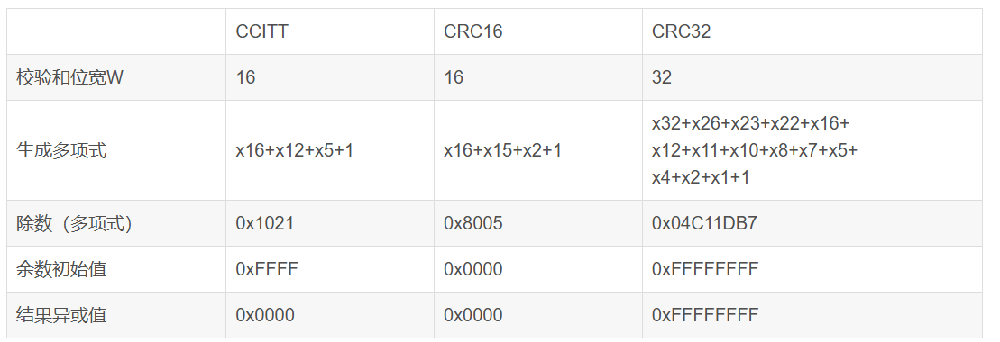

# 校验算法
[csdn_crc](https://blog.csdn.net/liyuanbhu/article/details/7882789?ops_request_misc=%257B%2522request%255Fid%2522%253A%25229cce1cfb368d0b703ca1b5b9380c414f%2522%252C%2522scm%2522%253A%252220140713.130102334..%2522%257D&request_id=9cce1cfb368d0b703ca1b5b9380c414f&biz_id=0&utm_medium=distribute.pc_search_result.none-task-blog-2~all~top_positive~default-1-7882789-null-null.142^v102^pc_search_result_base1&utm_term=crc%E6%A0%A1%E9%AA%8C&spm=1018.2226.3001.4187)
## 奇偶校验
在发送的每一个字节后都加上一位，使得每个字节中**1**的个数为奇数个或偶数个

比如我们要发送的字节是0x1a，二进制表示为0001 1010。
- 采用奇校验，则在数据后补上个0，数据变为0001 1010 0，数据中1的个数为奇数个（3个）
- 采用偶校验，则在数据后补上个1，数据变为0001 1010 1，数据中1的个数为偶数个（4个）
## 累加和校验
最常用的一种是在一次通讯数据包的最后加入一个字节的校验数据。这个字节内容为前面数据包中全部数据的忽略进位的按字节累加和
- 我们要传输的信息为： 6、23、4，加上校验和后的数据包：6、23、4、33
## CRC算法
CRC 算法的基本思想是将传输的数据当做一个位数很长的数。将这个数除以另一个数。得到的余数作为校验数据附加到原数据后面
- 6、23、4 可以看做一个2进制数： 0000011000010111 00000010，假如被除数选9，二进制表示为：1001
最后的余数为1。如果我们将这个余数作为校验和的话，传输的数据则是：6、23、4、1
### 运算方式
#### 多项式的乘除法
- 1101变化为
$$
    1x^3+ 1x^2 + 0x + 1x^0
$$
- 1011变化为
$$
    1x^3 + 0x^2 + 1x^1 + 1x^0
$$
- 两个多项式的乘法
$$
    (1x^3+ 1x^2 + 0x + 1x^0)(1x^3 + 0x^2 + 1x^1 + 1x^0) = x^6 + x^5 + x^4 + x^3 + x^3 +x^2 + x^0
$$
得到结果后，合并同类项时采用模2运算。也就是说乘除法采用正常的多项式乘除法，而加减法都采用模2运算。所谓模2运算就是结果除以2后取余数。比如3 mod 2 = 1.加减法采用模2运算后其实就成了一种运算了，就是我们通常所说的异或运算
#### 除法运算
在计算前先将原始数据后面填上4个0：11010110110000，之所以要补0，后面再做解释。
采用了模2的加减法后，不需要考虑借位的问题，所以除法变简单了。最后得到的余数就是CRC 校验字
在CRC算法中，这个**被除数**有一个专有名称叫做“**生成多项式**”

生成多项式经常会说到多项式的位宽（Width，简记为W），这个位宽不是多项式对应的二进制数的位数，而是位数减1
比如CRC8中用到的位宽为8的生成多项式，其实对应得二进制数有九位：100110001
用16进制表示：如CRC32的生成多项式简记为04C11DB7实际上表示的是104C11DB7
#### 编程实现
假设我们的生成多项式为：100110001（简记为0x31），也就是CRC-8

则计算步骤如下：

（1）      将CRC寄存器（8-bits，比生成多项式少1bit）赋初值0

（2）      在待传输信息流后面加入8个0

（3）      While (数据未处理完)

（4）      Begin

（5）          If (CRC寄存器首位是1)

（6）              reg = reg XOR 0x31

（7）          CRC寄存器左移一位，读入一个新的数据于CRC寄存器的0 bit的位置。

（8）      End

（9）      CRC寄存器就是我们所要求的余数。
实际上，上述存在问题，数据流的开头添加一些0并不影响最后校验字的结果。

所谓的改动，也就是增加了两个概念，第一个是“余数初始值”，第二个是“结果异或值”。
所谓的“余数初始值”就是在计算CRC值的开始，给CRC寄存器一个初始值。“结果异或值”是在其余计算完成后将CRC寄存器的值在与这个值进行一下异或操作作为最后的校验值。

加入这些变形后，常见的算法描述形式就成了这个样子了：

（1）      设置CRC寄存器，并给其赋值为“余数初始值”。

（2）      将数据的第一个8-bit字符与CRC寄存器进行异或，并把结果存入CRC寄存器。

（3）      CRC寄存器向右移一位，MSB补零，移出并检查LSB。

（4）      如果LSB为0，重复第三步；若LSB为1，CRC寄存器与0x31相异或。

（5）      重复第3与第4步直到8次移位全部完成。此时一个8-bit数据处理完毕。

（6）      重复第2至第5步直到所有数据全部处理完成。

（7）      最终CRC寄存器的内容与“结果异或值”进行或非操作后即为CRC值。
```
#define POLY        0x1021
/**
 * Calculating CRC-16 in 'C'
 * @para addr, start of data
 * @para num, length of data
 * @para crc, incoming CRC
 */
uint16_t crc16(unsigned char *addr, int num, uint16_t crc)
{
    int i;
    for (; num > 0; num--)              /* Step through bytes in memory */
    {
        crc = crc ^ (*addr++ << 8);     /* Fetch byte from memory, XOR into CRC top byte*/
        for (i = 0; i < 8; i++)             /* Prepare to rotate 8 bits */
        {
            if (crc & 0x8000)            /* b15 is set... */
                crc = (crc << 1) ^ POLY;    /* rotate and XOR with polynomic */
            else                          /* b15 is clear... */
                crc <<= 1;                  /* just rotate */
        }                             /* Loop for 8 bits */
        crc &= 0xFFFF;                  /* Ensure CRC remains 16-bit value */
    }                               /* Loop until num=0 */
    return(crc);                    /* Return updated CRC */
}
```