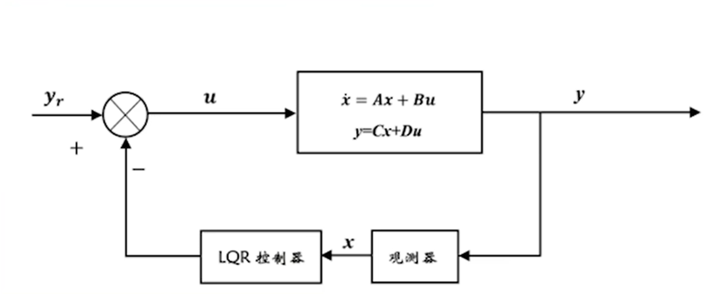
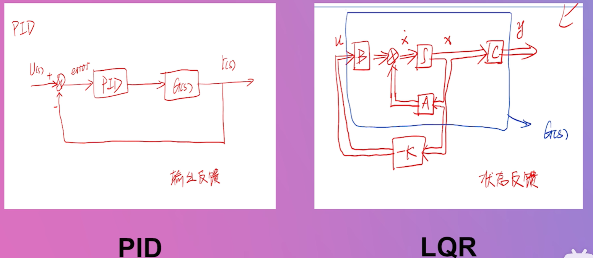

# LQR
## 全称 Linear+Quadratic+Regulator
1. Linear(线性模型)

   线性空间状态方程
$$
\begin{cases}
\dot{x}_1 = \dot{x} = x_2 \\
\dot{x}_2 = \ddot{x} = x_3 \\
\dot{x}_3 = \dddot{x} = -5x_3 - 3x_2 - 2x_1 + u
\end{cases}
$$
2. Quadratic(二次)

   二次代价函数，描述控制系统指标，函数值代表能量最优控制策略
$$
f(x,y)=x^2+2xy+y^2
$$
3. Regulator(调节器)
   控制算法，调节系统状态变量

| 优点                       | 缺点                             |
| -------------------------- | -------------------------------- |
| 线性模型                   | 对模型精确度有要求（线性时不变） |
| 能量最优（Quardratic）     | 实时性要求高                     |
| 多状态反馈(多输入，多输出) |
| 结构简单，易于调试         |

### pid与LQR

| pid          | LQR          |
| ------------ | ------------ |
| 输出反馈控制 | 状态反馈控制 |
### 如何去求增益矩阵

$G_(s)表示被控对象
$$
G_(s)= 
$$

$$
x=Ax+Bu
$$
$$
y=Cx+Du
$$

| 符号 | 意义                                                   |
| ---- | ------------------------------------------------------ |
| A    | 输入状态转移矩阵，描述了系统状态的演化规律。           |
| B    | 矩阵，描述了外部输入对系统状态的影响。                 |
| C    | 输出矩阵，描述了状态变量如何映射到输出信号。           |
| D    | 直接传递矩阵，描述了外部输入直接传递到输出信号的影响。 |
| x    | 状态变量，系统的内部状态，可以描述系统的动态特性。     |
| u    | 输入变量，系统的外部输入，可以是一个或者多个变量。     |
| Q    | 控制效果矩阵，表示控制器对状态变量的重视程度。         |
| R    | 状态效果矩阵，表示控制器对控制输入的重视程度。         |
（快捷键：alt+shift+f,规整布局）
## LQR控制
#### LQR控制的是线性时不变系统的状态变量x的变化
>具体而言，LQR通过对系统状态变量的反馈控制，使系统状态向着期望的状态稳定，并且能够实现一定的性能指标要求，如响应速度、稳态误差等。这是小字号的文本

我们设定一个线性反馈控制器
$u = −K*x$, 
用以得到输入参数$u$ 与状态变量$x$的关系（求解矩阵K KK的方法会在后面提到），此时第一行可以写为:
$$
\dot{x} = Ax - BKx = (A - BK) x \quad \underbrace{(A - BK)}_{A_{cl}}
$$

